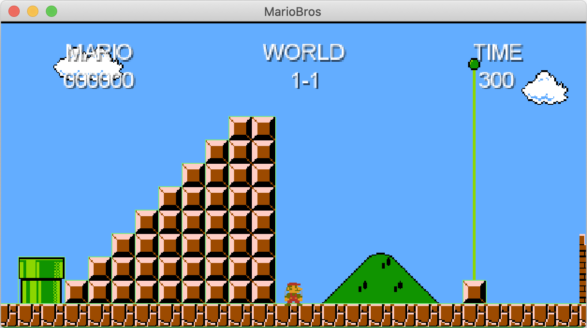

# Super Mario Bros. in Java

This project reproduces the first level of the legendary game Super Mario Bros.  
It has been developed in Java with the LibGDX library. 

### UML Global Architecture

### Preview
Screenshots of the game

    
    

